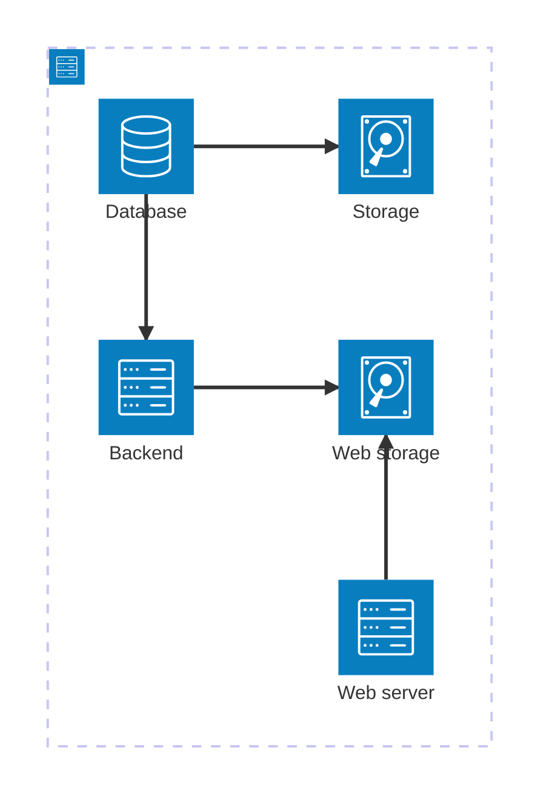

# CyberMarket

A market website made in the course d0018e

## Starting the application

Each part is a self contained container, to launch them we have provided a docker compose file for your convenience.
To run the docker file type

```bash
docker compose up --build
```

The structure of the services are as shown below



Note that you ether have run as superuser or be in the docker group

## Backend API

This section goes trough the REST api that is used to communicate to the backend server.

Note many paths require you to set the authorization header, when missing the server would respond with 404 to avoid leakage of data

### Authentication users TODO

This would return a token that could be used for authenticating the user.
*NOT IMPLEMENTED*

```curl
> POST /auth HTTP/1.1
> Host: example.org
> User-Agent: curl/7.81.0
> Accept: */*
> Content-Length: 23
> Content-Type: application/json
>
{
    "username" : "john_doe"
    "pswd" : "dog1234!"
}

< HTTP/1.1 200 OK
< Access-Control-Allow-Origin: *
< Date: Tue, 28 Jan 2025 12:25:02 GMT
< Content-Length: 55
< Content-Type: text/plain; charset=utf-8
<
{
    "token": "00112233445566778899aabbccddeeff",
    "username" : "john_doe",
    "userid" : 6
}
```

### Listing users

Calling ``GET http://example.org/users`` returns the public info off all users.
Note this query might be slow

```curl
> GET /users HTTP/1.1
> Host: example.org
> User-Agent: curl/7.81.0
> Accept: */*
>
< HTTP/1.1 200 OK
< Access-Control-Allow-Origin: *
< Date: Tue, 28 Jan 2025 12:25:02 GMT
< Content-Length: 55
< Content-Type: text/plain; charset=utf-8
<
[
    {
        "Id": 1,
        "Name": "myUser"
    },
    {
        "Id": 2,
        "Name": "SEAL_MAN"
    }
]
```

### Add a user

To add an user use the ``POST http://example.org/user``.
The body of this request, should contain ``name`` and ``pswd``.
Note that the max length of both pswd and name is 45 bytes

```curl
> POST /user HTTP/1.1
> Host: example.org
> User-Agent: curl/7.81.0
> Accept: */*
> Content-Length: 23
> Content-Type: application/json
>
{
    "name": "john_doe",
    "pswd": "dog1234!"
}

< HTTP/1.1 200 OK
< Access-Control-Allow-Origin: *
< Date: Tue, 28 Jan 2025 14:31:20 GMT
< Content-Length: 1
< Content-Type: text/plain; charset=utf-8
<
6
```

## Update user info

to update the user send a PATCH request to ``/users/{id}``. Possible return values are 404 if the user is not found. 400 is returned if the token is not valid
*Note auth is not implemented, token is ignored and assumed to be correct, return vales are also currently omitted*

```curl
> PATCH /users/6 HTTP/1.1
> Host: example.org
> User-Agent: curl/7.81.0
> Accept: */*
> Content-Length: 23
> Content-Type: application/json
>
{
    "token": "00112233445566778899AABBCCDDEEFF",
    "new_name": "svenne_bannan",
    "new_pswd": "cat4321?"
}

< HTTP/1.1 200 OK
< Access-Control-Allow-Origin: *
< Date: Tue, 28 Jan 2025 14:31:20 GMT
< Content-Length: 1
< Content-Type: text/plain; charset=utf-8
<
{
    "old_name": "john_doe",
    "new_name": "svenne_bannan",
}
```
